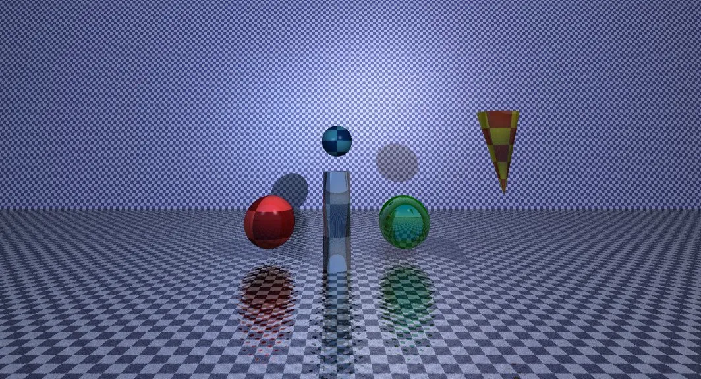
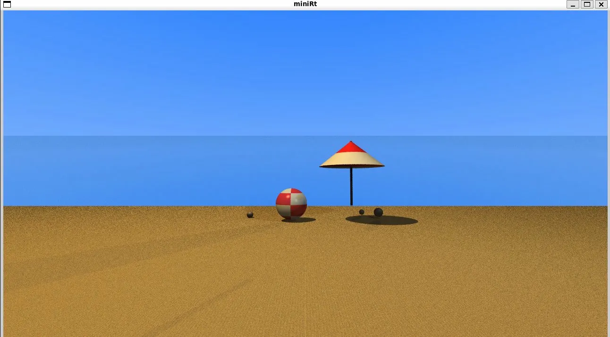

*This project was created as part of the 42 curriculum by rgregori, tlavared.*

# miniRT

> A ray tracer written from scratch in pure C, rendering 3D scenes with realistic Phong lighting.

| | |
|---|---|
|  |  |

---

## Description

**miniRT** is a ray tracer built from scratch in pure C as a project for [42 School](https://42.fr). It renders 3D scenes described in `.rt` text files, producing images with realistic lighting using the Phong reflection model.

For each pixel on the screen, a ray is cast from the camera into the scene. When it intersects an object, the color is computed based on ambient, diffuse, and specular lighting, shadows, and material properties:

```
P(t) = origin + t * direction
```

The visible object at each pixel is the one with the smallest positive `t` along the ray.

**Stack:** `C` · `MLX42` · `pthreads` · `CMake` · `Make`  
**School:** 42 São Paulo  
**Status:** ✅ Completed — mandatory + all bonus items implemented

### Features

| Feature | Mandatory | Bonus |
|---|:---:|:---:|
| Sphere, Plane, Cylinder | ✅ | ✅ |
| Cone | — | ✅ |
| Phong Lighting (ambient, diffuse, specular) | ✅ | ✅ |
| Shadows (shadow rays) | ✅ | ✅ |
| Multiple lights with accumulation | ✅ | ✅ |
| MSAA Anti-aliasing | — | ✅ |
| Recursive Reflection | — | ✅ |
| Per-object material properties (ks, kd, ka, shininess, reflectivity) | — | ✅ |
| Procedural Checkerboard | — | ✅ |
| Bump mapping (procedural via sine + PNG) | — | ✅ |
| Multi-threading with pthreads | — | ✅ |
| Sky color (miss ray) | — | ✅ |
| Resizable window | ✅ | ✅ |

---

## Instructions

### Dependencies

Before building, install the required system libraries.

**Ubuntu / Debian:**
```bash
sudo apt update
sudo apt install -y build-essential cmake libglfw3-dev libgl1-mesa-dev
```

**macOS (with Homebrew):**
```bash
brew install cmake glfw
```

> **Note:** `make` and `cc` (gcc or clang) are included in `build-essential` on Linux and in Xcode Command Line Tools on macOS (`xcode-select --install`).

MLX42 (the graphics library) is included as a Git submodule and compiled automatically via CMake on the first build — no manual installation required.

### Cloning

```bash
git clone --recurse-submodules https://github.com/rodrigo-americo/42_miniRT.git
cd 42_miniRT
```

If you already cloned without `--recurse-submodules`:
```bash
git submodule update --init --recursive
```

### Building

```bash
make          # mandatory version  →  ./miniRT
make bonus    # bonus version      →  ./miniRT_bonus
make debug    # debug build
```

### Running

```bash
./miniRT scenes/complex.rt
./miniRT_bonus scenes/bonus_full.rt
```

- Pass any `.rt` scene file as the argument
- Press `ESC` or close the window to exit
- The window supports resizing

---

## Scene Format (`.rt`)

Scene files are plain text. Each line defines one element.

### Global elements (exactly 1 of each)

```
A <intensity> <R,G,B>            # Ambient light
C <x,y,z> <dx,dy,dz> <fov>      # Camera
L <x,y,z> <brightness> <R,G,B>  # Point light (multiple allowed)
```

### Objects

```
sp <x,y,z> <diameter> <R,G,B>
pl <x,y,z> <nx,ny,nz> <R,G,B>
cy <x,y,z> <ax,ay,az> <diameter> <height> <R,G,B>
cn <x,y,z> <ax,ay,az> <diameter> <height> <R,G,B>   # bonus only
```

### Bonus material parameters (optional, appended after color)

```bash
# Phong only
sp ... <R,G,B> <ks> <kd> <ka> <shininess> <reflectivity>

# Phong + checkerboard
sp ... <R,G,B> <ks> <kd> <ka> <shininess> <reflectivity> <R2,G2,B2> <checker_scale>

# Phong + checkerboard + bump mapping
sp ... <R,G,B> <ks> <kd> <ka> <shininess> <reflectivity> <R2,G2,B2> <checker_scale> <bump_scale> <bump_path>
# Use "none" as bump_path for procedural (sine-based) bump
```

Defaults when omitted: `KA=0.2` · `KD=0.7` · `KS=0.2` · `SHININESS=30` · `REFLECTIVITY=0`

### Minimal example

```
A 0.3 255,255,255
C 0,5,-20 0,-0.2,1 60
L -20,30,-10 0.8 255,255,255

sp 0,0,15 6.0 255,0,0
pl 0,-3,0 0,1,0 200,200,200
cy 0,-3,2 0,1,0 2.0 6.0 255,128,0
```

### Validations

- Exactly 1 camera (`C`) and 1 ambient light (`A`) per file
- File must have a `.rt` extension
- Intensities and brightness: `[0.0, 1.0]`
- RGB colors: `[0, 255]`
- Orientation vectors: components in `[-1.0, 1.0]`
- FOV: `[0, 180]`
- Diameter and height: positive values

---

## Architecture

```
42_miniRT/
├── include/          Mandatory version headers
├── include_bonus/    Bonus version headers
├── src/              Mandatory source code (28 files)
│   ├── parser/       .rt file parsing & validation
│   ├── intersect/    Ray-object intersection (sphere, plane, cylinder)
│   ├── lighting/     Phong model + shadow rays
│   ├── vectors/      3D vector math library
│   ├── draw/         Pixel-by-pixel render loop
│   └── color/        RGBA operations & conversion
├── src_bonus/        Bonus source code (43 files)
│   ├── intersect/    + cone, checkerboard, bump mapping
│   ├── lighting/     + recursive reflection
│   ├── multithread/  Thread workers & tile queue
│   └── scene/        Material params, defaults, bump loading
├── images/           Rendered output samples
├── scenes/           Sample and test .rt files
├── libft/            Custom C library
└── MLX42/            Graphics library (submodule)
```

---

## Resources

### Ray Tracing

- [_Ray Tracing in One Weekend_](https://raytracing.github.io/books/RayTracingInOneWeekend.html) — Peter Shirley. The foundational reference for this project.
- [Scratchapixel](https://www.scratchapixel.com/) — In-depth articles on ray-sphere intersection, the Phong model, shadows, and more.
- [Phong Reflection Model — Wikipedia](https://en.wikipedia.org/wiki/Phong_reflection_model) — Overview of ambient, diffuse, and specular components.
- [Bump Mapping — Wikipedia](https://en.wikipedia.org/wiki/Bump_mapping) — Explanation of normal perturbation techniques.

### Libraries

- [MLX42](https://github.com/codam-coding-college/MLX42) — Cross-platform graphics library used for window management and pixel rendering.
- [GLFW](https://www.glfw.org/docs/latest/) — Windowing and input library (MLX42 dependency).

### AI Usage

AI assistance (ChatGPT / GitHub Copilot) was used during this project for the following tasks:

- **Debugging geometric edge cases** — helping identify off-by-one errors in ray-cylinder cap intersection and cone height clamping.
- **Explaining math concepts** — clarifying tangent/bitangent frame construction for bump mapping and the derivation of quadratic discriminants.
- **Code review suggestions** — reviewing parser error handling logic and suggesting cleaner validation patterns.
- **No code was generated wholesale by AI.** All implementations were written and understood by the authors; AI was used as an interactive reference, not a code generator.

---

## Authors

| Contributor | Main contributions |
|---|---|
| **rgregori** ([@rodrigo-americo](https://github.com/rodrigo-americo)) | Full parser, lighting, geometric calculations, bonus items (cone, MSAA, reflection, bump mapping, checkerboard, materials) |
| **tlavared** ([@Talen400](https://github.com/Talen400)) | Geometric calculations, multi-threading with pthreads, overall structure |
